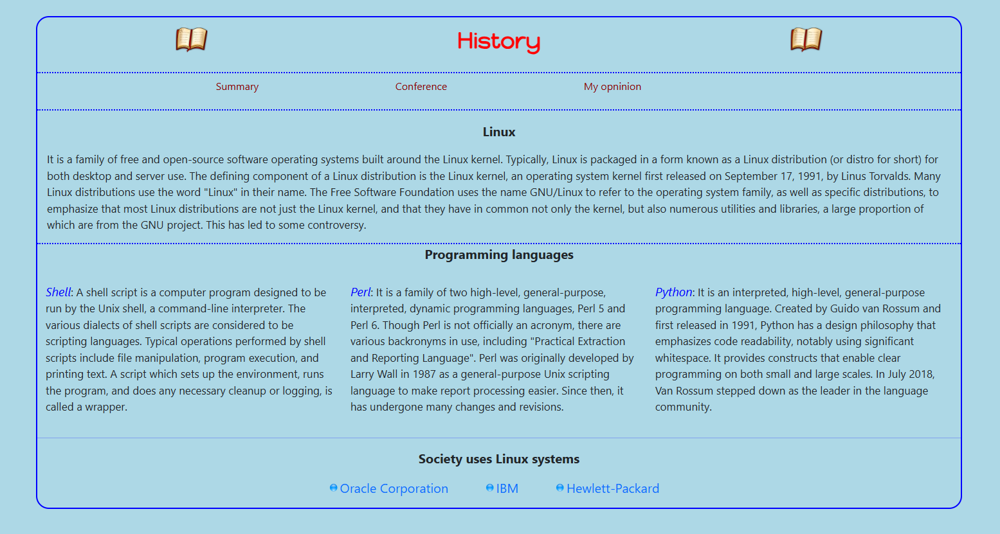

# LinuxSite
A site, with multiple HTML pages, created in the free time that brings together all the features of Linux with even a hint of the main languages, supported by this OS and with a video of Linus Torvald, the creator of Linux.  

